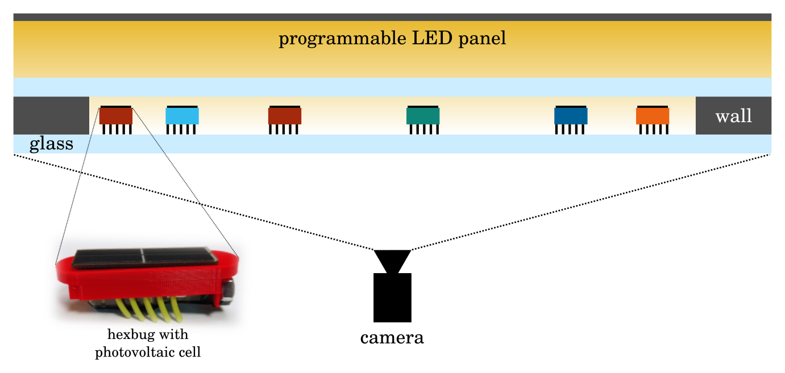

> Follow PhotoActive on <a href="https://www.instagram.com/photoactive_msca/?hl=en" target="_blank">Instagram</a>!

# What are we doing?

We are studying small bugs that respond to light by moving. When exposed to higher illumination, they move faster; with lower illumination, they slow down. To investigate this behavior, we designed an arena with a large LED panel that allows precise control of light intensity across space and time. By placing numerous bugs in the arena and applying various illumination patterns, we can observe how they react. As they move, they collide with one another and with the arena's walls, forming dynamic groups that may move or stay stable. These groups can merge, split, and exhibit fascinating collective behaviors.

### This is the experimental setup

The particles are modified <a href="https://hexbug.com/" target="_blank">Hexbug Nanos</a>, small "robots" equipped with a small battery, a rotating motor, and flexible tilted rubber legs. When activated, they vibrate and move. We customized the Hexbugs, as shown above, by removing the battery and adding a red plastic cap that holds a photovoltaic cell. This modification makes them light-responsive, allowing movement only when illuminated. Higher illumination increases vibration intensity, causing them to move faster, while lower illumination results in weaker vibrations and slower movement. This enables precise control over their activity by simply adjusting the light levels.

### This is how the particles move with different illumination...

<iframe src="https://drive.google.com/file/d/1h4iLuwyD9wWg8wfvG62p63ETD6yDVHag/preview" width="768" height="555" allow="autoplay" style="border:none;"></iframe>

To control the illumination, we built a large 80 cm × 80 cm LED panel, which allows us to precisely adjust light intensity. The panel can be programmed line by line, enabling dynamic changes in illumination across space and time. This gives us external control over the activity of the bugs. The bugs are placed beneath the panel in an 80 cm × 80 cm arena enclosed by 3D-printed walls, which can be easily modified in shape and size.

When we introduce a large number of bugs into the arena and turn on the light, they begin to move, collide with each other and the walls, and exhibit fascinating collective behaviors. A camera positioned beneath the arena records their movements, allowing us to track individual particles and analyze their motion. From these recordings, we extract valuable data and insights into their behavior.

### ... and this is how a collision looks like

<iframe src="https://drive.google.com/file/d/1UDFSjY-iTHDi4stuPuxUgKJP5odm9Syr/preview" width="768" height="185" allow="autoplay"></iframe>

# What we have studied so far?

First, we focused on applying uniform illumination across the arena to study how particle clusters form and disperse. We conducted numerous experiments, varying both the particle population and the illumination intensity to observe their effects on cluster dynamics.

### This is an image from the experiments

As particles collide, they form groups known as clusters. These clusters vary in size—some remain small, while others grow larger. They can move freely or stay near the walls. When new particles collide with a cluster, they may attach to it, while others may break away and leave.

Our observations show that small clusters tend to disperse quickly, whereas larger clusters are generally more stable and last longer. The stability of these clusters is strongly influenced by the activity level of the bugs. When their activity is high, frequent movement and collisions within the cluster accelerate its breakdown, leading to faster dissolution.
 

### In this video you can check how the clusters behave

<iframe src="https://drive.google.com/file/d/1wMwmL4mDQV-yT5vslmJWSbXSGugTfVp6/preview" width="450" height="450" allow="autoplay" align="right" style="margin-left:50px;"></iframe>
This video captures an experiment with 120 particles under low homogeneous illumination intensity.

Numerous clusters form throughout the experiment, with some growing relatively large and remaining stable for extended periods. While most clusters eventually dissolve, one in particular (the yellow cluster) continues to grow steadily, eventually incorporating around 75% of the bugs by the end of the experiment.

Through repeated experiments, we have observed that lower illumination levels combined with a high particle population promote cluster stability.
 

At low particle populations and high activity levels, clusters form and break apart rapidly, making them highly unstable. However, as the particle population increases and activity decreases, we observe a transition from unstable to stable clusters. These stable clusters continue to grow, incorporating most of the bugs and remaining intact throughout the experiment.

For a deeper dive into this transition, check out our [paper in PRL](https://journals.aps.org/prl/abstract/10.1103/t7st-flj2){:target="_blank"}. We have also developed a kinetic model to describe the time evolution of clusters, which closely aligns with our experimental findings.

# What are we working on now?

We've shifted our focus from uniform illumination to inhomogeneous lighting to take full advantage of our experimental setup's versatility. We are investigating how bugs accumulate in lower-illuminated regions, how this affects cluster formation, and what happens when we suddenly increase the illumination in these areas. Additionally, we are running simulations to gain deeper insights into particle motion and behavior.

Stay tuned—exciting new results are on the way!

 

