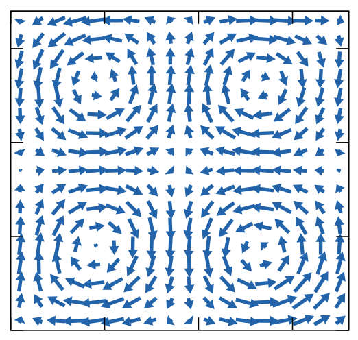

# Publications

* [Cluster dynamics in macroscopic photoactive particles](https://arxiv.org/abs/2412.14419){:target="_blank"}  
  **S. Lévay**, A. Katona, H. Löwen, R. Cruz Hidalgo, I. Zuriguel  
  Phys. Rev. Lett., 135, 098301 (2025).
  
  
  We present an experimental study on the collective behavior of macroscopic self-propelled particles that are externally excited by light. This property allows testing the system response to the excitation intensity in a very versatile manner. We discover that for low excitation intensities, clustering at the boundaries is always present, even when this is prevented by implementing flower-shaped confining walls. For high excitation intensities, however, clusters are dissolved more or less easily depending on their size. Then, a thorough analysis of the cluster dynamics allows us to depict a phase diagram depending on the number of agents in the arena and the excitation intensity. To explain this, we introduce a simple kinetic model where cluster evolution is governed by a balance between adsorption and desorption processes. Interestingly, this simple model is able to reproduce the phase space observed experimentally.
 

* [Transverse vortices induced by modulated granular shear flows of elongated particles](https://arxiv.org/abs/2502.10079){:target="_blank"}  
  **S. Lévay**, P. Claudin, E. Somfai, T. Börzsönyi  
  Phys. Rev. E, 112, 015402 (2025).
  
  
  We have performed DEM simulations of elongated grains in a shear cell for various particle aspect ratios and contact frictions, with an additional heterogeneous force perturbation in the flow direction. For a perturbation in the form of a single Fourier mode, we show that the response of the system consists of transverse secondary flows that average onto a pattern of four vortices. We have also theoretically studied this phenomenon by generalizing the granular rheology μ(I) to the case of elongated grains and computing the linear response to such a perturbation. Even if the agreement between theory and simulations remains qualitative only, we can reproduce and understand the inversion of the vortex pattern when the cell aspect ratio is increased from a vertically to a horizontally elongated cell shape, emphasizing the key role of the second normal stress difference as well as the cell geometry.
 
  
* [Lacunarity as a quantitative measure of mixing—a micro-CT analysis-based case study on granular materials](https://academic.oup.com/ooms/article/3/1/itad014/7245866){:target="_blank"}  
  L. Vásárhelyi, D. Sebők, I. Szenti, Á. Tóth, **S. Lévay**, R. Vajtai, Z. Kónya, Á. Kukovecz  
  Oxford Open Materials Science, 3, 1 (2023).
  
  
  In practically every industry, mixing is a fundamental process, yet its 3D analysis is scarce in the literature. High-resolution computed tomography (micro-CT) is the perfect X-ray imaging tool to investigate the mixing of granular materials. Other than qualitative analysis, 3D micro-CT images provide an opportunity for quantitative analysis, which is of utmost importance, in terms of efficiency (time and budget) and environmental impact of the mixing process. In this work, lacunarity is proposed as a measure of mixing. By the lacunarity calculation on the repeated micro-CT measurements, a temporal description of the mixing can be given in three dimensions. As opposed to traditional mixing indices, the lacunarity curve provides additional information regarding the spatial distribution of the grains. Discrete element method simulations were also performed and showed similar results to the experiments.
 

* [Interacting jammed granular systems](https://journals.aps.org/pre/abstract/10.1103/PhysRevE.103.042901){:target="_blank"}  
  **S. Lévay**, D. Fischer, R. Stannarius, E. Somfai, T. Börzsönyi, L. Brendel, and J. Török  
  Phys. Rev. E, 103, 042901 (2021).
  
  
  We have shown, that a 2+ε-dimensional geometrically frustrated confined system (introduced here) can be described by the Edwards ensemble, the partition function can be formulated analytically, and the observables can be calculated analytically. By connecting two well-defined systems we have shown, that the case of coupled subsystems can only be described by the Edwards ensemble if the stress equilibrium is taken into account at the microstate level and the partition function of the full system is calculated.
 
 
* [Flow in an hourglass: particle friction and stiffness matter](https://iopscience.iop.org/article/10.1088/1367-2630/abddf5){:target="_blank"}  
T. Pongó, V. Stiga, J. Török, **S. Lévay**, B. Szabó, R. Stannarius, R. Cruz Hidalgo, and T. Börzsönyi  
  New Journal of Physics, 23, 023001 (2021).  

  
  We have studied the effect of particle stiffness and coefficient of friction on the flow behavior of spherical particles in a silo by means of DEM simulations and experiments. We have shown, that the interparticle friction has a much stronger effect for soft grains than for hard grains.
 

* [Frustrated packing in a granular system under geometrical confinement](https://pubs.rsc.org/en/content/articlehtml/2017/sm/c7sm01900a){:target="_blank"}  
  **S. Lévay**, D. Fischer, R. Stannarius, B. Szabó, T. Börzsönyi, and J. Török  
  Soft Matter, 14, 396-404 (2018).
  
  
  We have shown by means of DEM simulations and experiments that the ordering of monodisperse spherical particles during shaking in a narrow, 2+ε-dimensional cuboid cell is driven by the area change of local 7-particle configurations and the antiferromagnetic vertical alignment. We have shown that the ground state of the system is never reached due to the formation of perfectly ordered incompatible domains. Our Monte Carlo simulations revealed that in order to reach the ground state further, unfavourable events with very small probability would be needed.
 

* [Arching in three dimensional clogging](https://www.epj-conferences.org/articles/epjconf/abs/2017/09/epjconf162549/epjconf162549.html){:target="_blank"}  
  J. Török, **S. Lévay**, B. Szabó, E. Somfai, S. Wegner, R. Stannarius, and T. Börzsönyi
  EPJ Web Conf., 140, 03076 (2017).
  
  
  We have studied three-dimensional clogging by means of DEM simulations with spherical and elongated particles. We have shown, that the clogged structure above the orifice is a primary, two-dimensional arch supported by secondary arches, and the interparticle force network of the system shows an onion-like layered structure.
 
  
* [Multiple shear bands in granular materials](https://www.epj-conferences.org/articles/epjconf/abs/2017/09/epjconf162590/epjconf162590.html){:target="_blank"}  
  **S. Lévay** and J. Török
  EPJ Web Conf., 140, 03084 (2017).
  
  
  We studied the transition regime from quasi-static to dynamic shear by means of DEM simulations and a mesoscopic model. We have shown that at a moderate shear rate multiple shear bands appear which eventually appear as a continuous shear profile for large shear rates. We also have shown how the long range order present in the quasi-static regime is gradually destroyed by the presence of multiple shear bands.
 
  
  
* [Segregation of granular mixtures in a spherical tumbler](https://journals.aps.org/pre/abstract/10.1103/PhysRevE.93.032903){:target="_blank"}  
  T. Finger, F. v. Rüling, **S. Lévay**, B. Szabó, T. Börzsönyi, and R. Stannarius
  Phys. Rev. E, 93, 032903 (2016).
  
  
  In this study we described the axial segregation of bidisperse granular mixtures of glass beads in a spherical container, rotating about its horizontal axis. Depending on the filling fraction of the mixer and on the composition of the mixture, qualitatively different spontaneously formed patterns were observed. This evidences a collective pattern forming mechanism.
 
  
  
  
  

# Conferences

* **Talk:** _Collective dynamics of macroscopic photoactive particles_  
  FisEs’25, XXV Congreso de Física Estadística, Santiago de Compostela, Spain (2025).

* **Talk:** _Collective behavior of photoactive macroscopic particles: an experimental study of cluster dynamics_  
  APS Global Physics Summit, Anaheim, USA (2025).
  

* **Talk:** _Collective behavior of macroscopic light-driven active particles: an experimental study of cluster formation_  
  Traffic and Granular Flow, Lyon, France (2024).
  
* **Talk:** _Cluster formation in a system of photoactive macroscopic particles_  
  2nd Spanish Soft Matter 1 1/2 Day, Benasque, Spain (2024).
  
* **Talk & poster:** _Cluster formation in macroscopic active particles driven by light_  
  Granular Matter Gordon Research Conference and Seminar, Easton, USA (2024).
  
* **Talk:** _Experimental and numerical study of the collective behavior of macroscopic light-driven active particles_  
  Collective Motions of Animals and Robots, Cargèse, France (2024).
  
* **Poster:** _Macroscopic active particles driven by light_  
  1st Spanish Soft Matter 1 1/2 Day, Benasque, Spain (2023).
  
* **Poster:** _Macroscopic active particles driven by light_  
  XXIV Congress of Statistical Physics (FisEs’23), Pamplona, Spain (2023).
  
* **Talk:** _Applying Edwards theory for a 2+ϵ dimensional frustrated granular system_  
  DPG Virtual Spring Meeting (2021).
  
* **Talk:** _Studying the quasistatic shear of granular materials_  
  Annual European Rheology Conference (AERC), Portoroz, Slovenia (2019).
  
* **Talk:** _Simulation and modeling of the frustrated packing in a granular system_  
  DPG Spring Meeting, Berlin, Germany (2018).
  
* **Talk:** _Arching and clogging in three-dimensional silo_  
  V. International Conference on Particle-Based Methods, Hannover, Germany  (2017).
  
* **Poster:** _Multiple shear bands in granular materials_  
  Powders & Grains, Montpellier, France (2017).
  
* **Poster:** _Arching in three-dimensional clogging_  
  Powders & Grains, Montpellier, France (2017).
  
* **Talk:** _Dynamical mesoscopic model for granular shear_  
  80th Annual Meeting of the DPG and Spring Meeting, Regensburg, Germany (2016).
  
